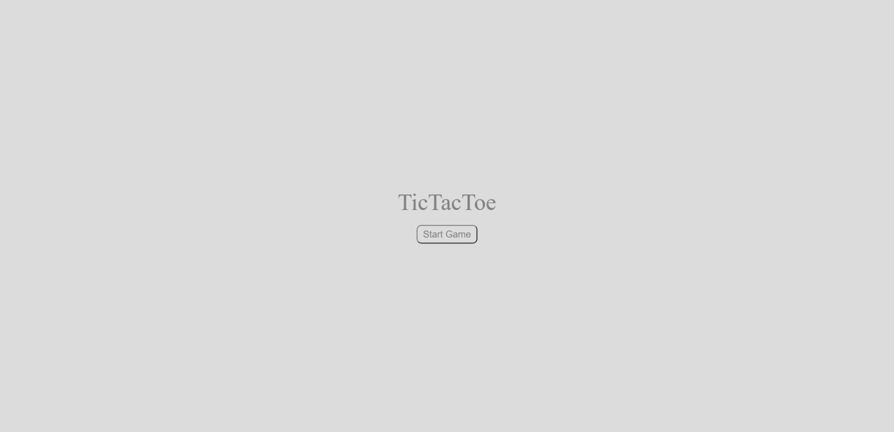
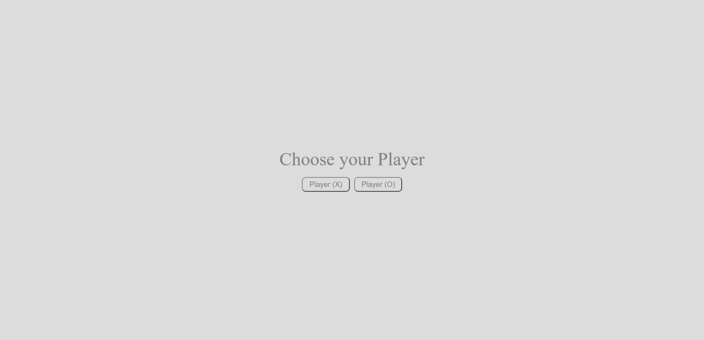
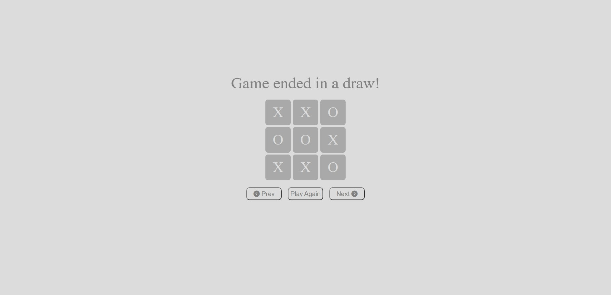
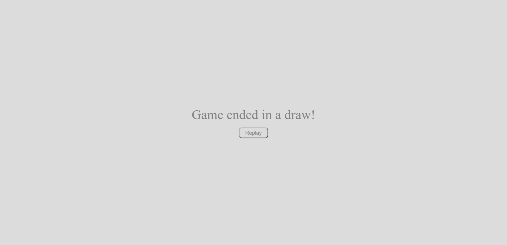

<h2>About the project ❓</h2>

 
A simple tic tac toe website. A game in which two players seek in alternate turns to complete a row, a column, or a diagonal with either three O's or three X's drawn in the spaces of a grid of nine squares..

👉 Live Demo: <a href='https://tictactoe-rthrx44.vercel.app/'>Live Demo</a>

<h3>Build with</h3> 

<h2>Screenshots of the Project 📸</h2>
 

<h3 align='center'>Landing Page</h3>

<h3 align='center'>Choose Page</h3>

<h3 align='center'>Board Page</h3>

<h3 align='center'>Result Page</h3>

